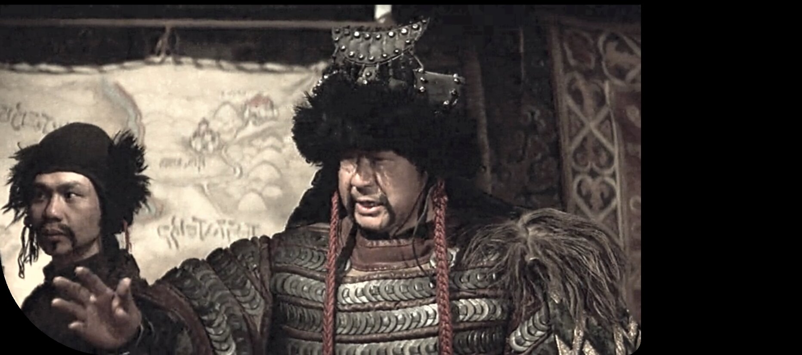

##    What's best in life?

- focus
- growth
- excitement
- integration
- inspiration
- interactions

## Where I'm at

- on the verge of software productivity
- eager doseq clojure

 
 

more: What I'm currently :brain:washed by | Where I see myself in 2023

## What I'm currently brainwashed by

- pragmatic functional programming with a [rich](https://www.youtube.com/watch?v=-6BsiVyC1kM "Rich Hickey: The Value of Values") flavor
- the playfulness and curiosity of [dabeaz](https://www.youtube.com/watch?v=pkCLMl0e_0k " David Beazley: Lambda Calculus from the Ground Up")
- [IO hoisting](https://www.youtube.com/watch?v=PBQN62oUnN8 "Brandon Rhodes: Hoist Your I/O") 
- fulcro & the [teaching style of Tony Kay](https://www.youtube.com/playlist?list=PLVi9lDx-4C_TBRiHfjnjXaK2J3BIUDPnf "Tony Kay: Grokking Fulcro Series")
- [zombie-themed pairing sessions](https://youtu.be/6qnNtVdf08Q "braaains")
  
## Where I see myself in 2023

- doing FOSS contributions
- in co-working atmospheres
- interning at a friendly tech company

[:envelope: Contact](mailto:adrech@grooveroom.de "adrech@grooveroom.de") | [:key: GPG](https://raw.githubusercontent.com/adrech/adrech/master/adrech.asc)
